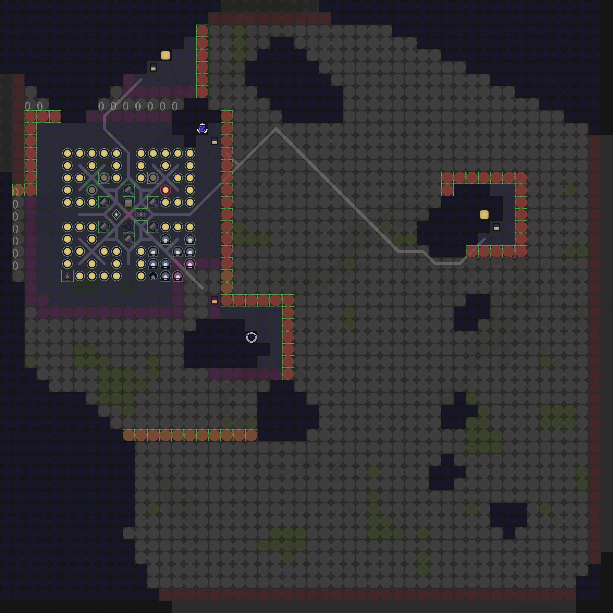

# screeps-sideServer

一个用于在 screeps 游戏外与 screeps 代码通信并运行大计算量代码的模块。

目前功能：

1. 在本地计算布局并生成布局预览图像，将布局数据传回游戏的 Memory


支持类似游戏内的 visual 方法。修改并使用了 overmind 的 mincut 代码。


## 使用

```
npm install
```

## 测试

参照 authInfoSample.ts 写 authInfo.ts 文件进行测试。authInfo.ts 文件不会上传至 github。

完成 authInfo.ts 文件后，使用

```
npm run test
```

进行测试。
