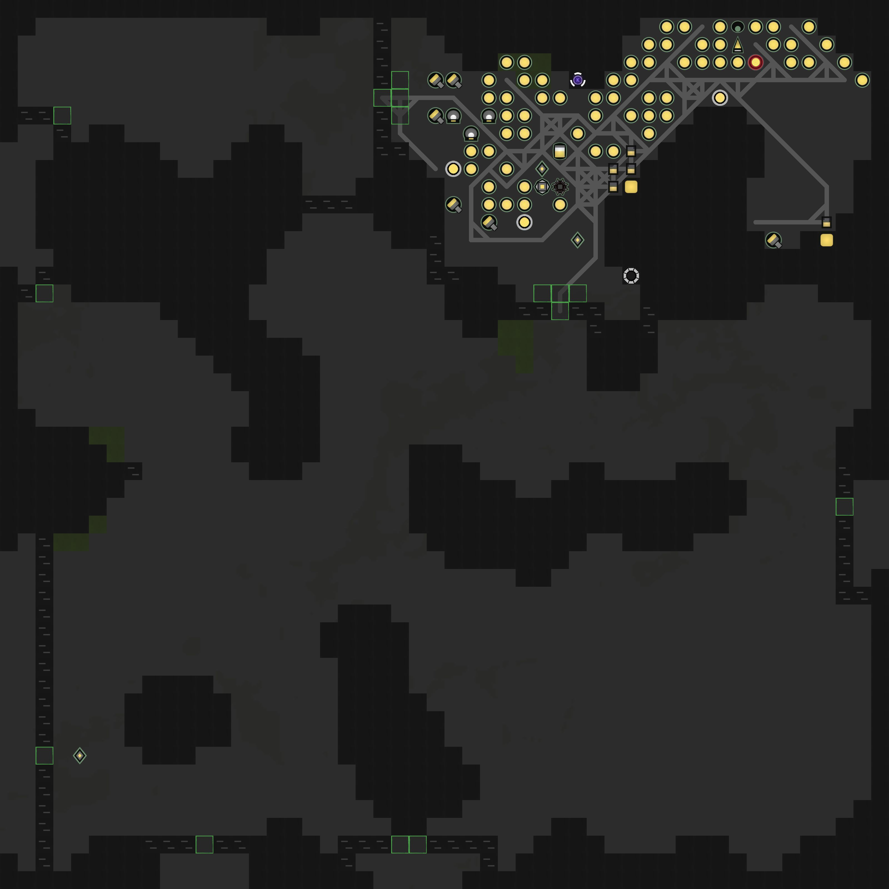

# screeps-sideServer

一个用于在 screeps 游戏外与 screeps 代码通信并运行大计算量代码的模块。

目前功能：

1. 在本地计算布局并生成布局预览图像，将布局数据传回游戏的 Memory



支持类似游戏内的 visual 方法。下图使用了 hoho 的固定布局数据计算布局位置，修改并使用了 overmind 的 mincut 代码来计算 rampart 布局。


## 使用

```
npm install
```

## 测试

参照 authInfoSample.ts 写 authInfo.ts 文件进行测试。authInfo.ts 文件不会上传至 github。

完成 authInfo.ts 文件后，使用

```
npm run test
```

进行测试。

## 用于自动化布局

使用npm run devTest文件来查看特定地图的布局，可用于游戏起始布局时查看第一个spawn的位置。

参照 authInfoSample.ts 写 authInfo.ts 文件之后，使用

```
rollup -c && node -r source-map-support/register dist/main.js YOUR_INFO_NAME
```

来运行自动化脚本生成布局数据并传输到对应SegmentMemory。

YOUR_INFO_NAME为你authInfo里写的配置项名字。
