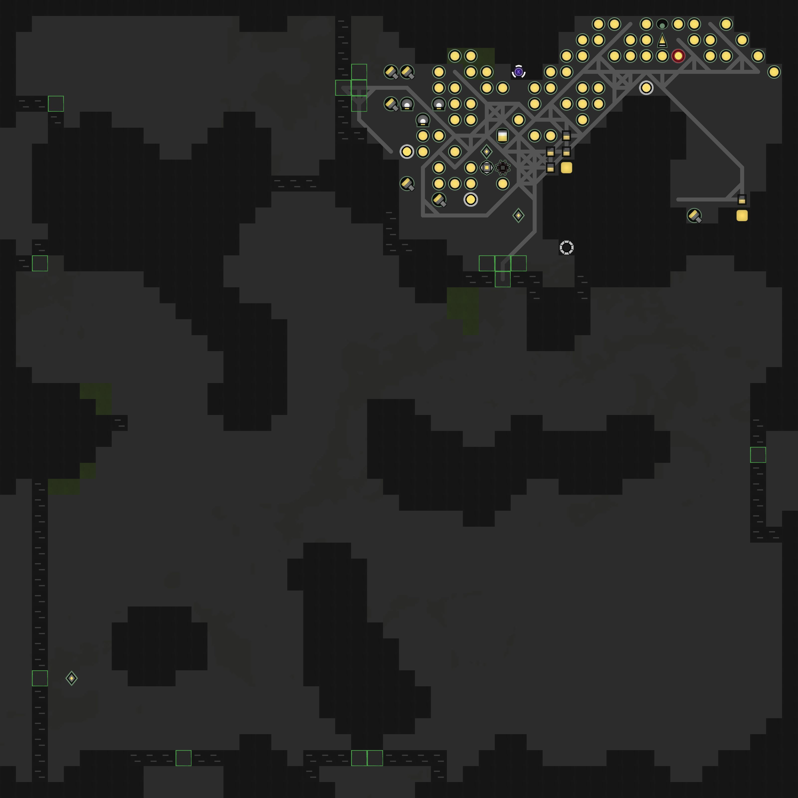
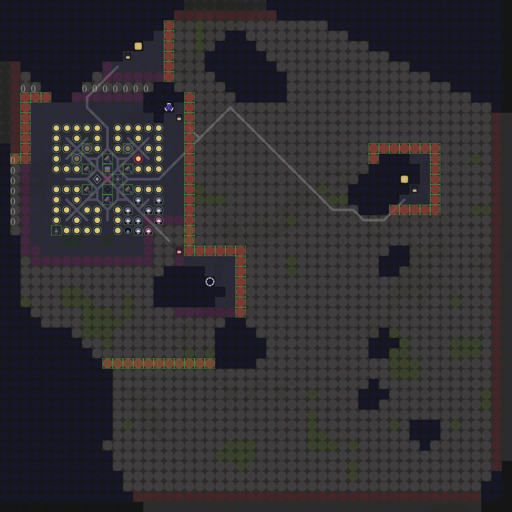

# screeps-sideServer

一个用于在 screeps 游戏外与 screeps 代码通信并运行大计算量代码的模块。

目前功能：

1. 在本地计算布局并生成布局预览图像，将布局数据传回游戏的 Memory



支持类似游戏内的 visual 方法。下图使用了 hoho 的固定布局数据计算布局位置，修改并使用了 overmind 的 mincut 代码来计算 rampart 布局。


## 使用

```
npm install
```

## 测试

参照 authInfoSample.ts 写 authInfo.ts 文件进行测试。authInfo.ts 文件不会上传至 github。

完成 authInfo.ts 文件后，使用

```
npm run test
```

进行测试。

## 用于自动化布局

使用npm run devTest文件来查看特定地图的布局，可用于游戏起始布局时查看第一个spawn的位置。

参照 authInfoSample.ts 写 authInfo.ts 文件之后，使用

```
rollup -c && node -r source-map-support/register dist/main.js YOUR_INFO_NAME
```

来运行自动化脚本生成布局数据并传输到对应SegmentMemory。

YOUR_INFO_NAME为你authInfo里写的配置项名字。

## WebSocket 实时触发模式 (推荐)

通过 WebSocket 监听游戏 console 输出，实时触发计算任务，无需轮询。

### 启动

```bash
rollup -c && node -r source-map-support/register dist/main.js YOUR_INFO_NAME --ws
```

### 游戏内触发

在游戏代码中添加：

```javascript
// 触发布局计算
console.log("sideServer:run");

// 带参数的触发 (可匹配自定义模式)
// console.log("sideServer:run:custom");
```

### 自定义触发模式

```bash
# 使用正则匹配自定义触发词
node -r source-map-support/register dist/main.js YOUR_INFO_NAME --ws --pattern=sideServer:run:(\w+)
```

### 优势

- **实时性**: WebSocket 推送，毫秒级延迟
- **省资源**: 建立一次连接，持续监听
- **简单**: 游戏内只需 `console.log()` 即可触发

### 工作流程

```
游戏内 console.log("sideServer:run")
        ↓
    WebSocket 推送
        ↓
    立即触发本地计算
        ↓
    结果写回 SegmentMemory
```
